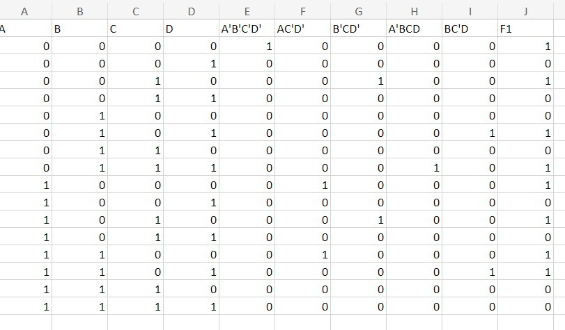

# BOOLEAN_FUNCTION_MINIMIZATION

**AIM:**

To implement the given logic function verify its operation in Quartus using Verilog programming.

F1= A’B’C’D’+AC’D’+B’CD’+A’BCD+BC’D 

F2=xy’z+x’y’z+w’xy+wx’y+wxy

**Equipment Required:**

Hardware – PCs, Cyclone II , USB flasher

**Software – Quartus prime**

**Theory**
A combinational circuit is a circuit in which the output depends on the present combination of inputs. Combinational circuits are made up of logic gates. The output of each logic gate is determined by its logic function. Combinational circuits can be made using various logic gates, such as AND gates, OR gates, and NOT gates.

**Procedure**

1.	Type the program in Quartus software.

2.	Compile and run the program.

3.	Generate the RTL schematic and save the logic diagram.

4.	Create nodes for inputs and outputs to generate the timing diagram.

5.	For different input combinations generate the timing diagram.


**Program:**

Program to implement the given logic function and to verify its operations in quartus using Verilog programming. 

```
module Boolean_min(A,B,C,D,W,X,Y,Z,F1,F2);
input A,B,C,D,W,X,Y,Z;
wire x1,x2,x3,x4,x5,x6,x7,x8,x9,x10;
output F1,F2;
assign x1=(~A)&(~B)&(~C)&(~D);
assign x2=(A)&(~C)&(~D);
assign x3=(~B)&(C)&(~D);
assign x4=(~A)&(B)&(C)&(D);
assign x5=(B)&(~C)&(D);
assign x6=(X)&(~Y)&(Z);
assign x7=(~X)&(~Y)&(Z);
assign x8=(~W)&(X)&(Y);
assign x9=(W)&(~X)&(Y);
assign x10=(W)&(X)&(Y);
assign F1=x1|x2|x3|x4|x5;
assign F2=x6|x7|x8|x9|x10;
endmodule
```

Developed by: SHIVRAJ R 

RegisterNumber: 212223110051


**RTL realization**


**TIMETABLE**



**Timing Diagram**


**Result:**

Thus the given logic functions are implemented using and their operations are verified using Verilog programming.

